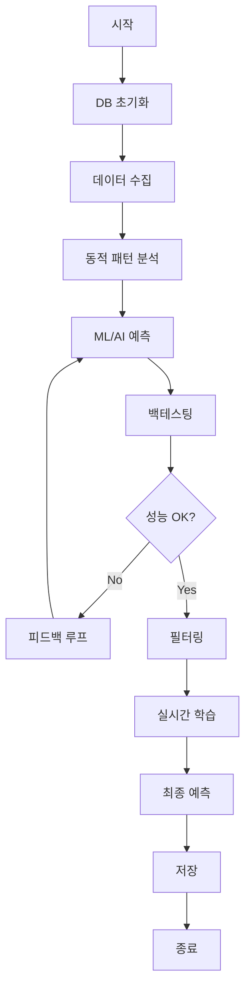

# 🎯 로또 프로그램 전체 로직 순서도

## 📋 개요
이 문서는 로또 예측 프로그램의 전체 실행 순서를 상세하게 설명합니다.

---

## 🔄 전체 실행 흐름

```
[시작] → [초기화] → [데이터 수집] → [패턴 분석] → [ML/AI 예측] 
        → [백테스팅] → [필터링] → [실시간 학습] → [최종 예측] → [저장] → [종료]
```

---

## 📝 상세 로직 순서

### 1️⃣ **프로그램 초기화** (0-5초)
```
├─ 로그 파일 초기화 (기존 로그 삭제)
├─ 명령줄 인수 파싱
├─ 설정 파일(config.yaml) 로드
├─ 로깅 시스템 설정
└─ 시작 시간 기록
```

### 2️⃣ **데이터베이스 초기화** (5-10초)
```
├─ MetaDataManager 초기화
├─ 데이터베이스 호환성 검사
├─ 필요시 마이그레이션 수행
├─ DatabaseManager 초기화
├─ 저장 모드 설정 (optimized/legacy)
└─ 각종 특수 DB 초기화 (패턴, 필터별 DB 등)
```

### 3️⃣ **자동 조정 시스템 초기화** (1-2초)
```
├─ AutoAdjustmentSystem 초기화
├─ 패턴 추적 시스템 활성화
├─ 필터 업데이트 주기 설정 (매 회차마다)
├─ 성능 모니터링 초기화
└─ 백테스팅 상태 로드
```

### 4️⃣ **데이터 수집** (5-30초, 네트워크 속도에 따라)
```
├─ DataCollector 초기화
├─ 동행복권 API 호출
├─ 최신 당첨번호 수집
├─ 데이터베이스 업데이트
└─ 수집 완료 확인
```

### 5️⃣ **동적 패턴 분석** (10-20초) 📊
```
├─ 최근 200회차 데이터 로드
├─ 6가지 핵심 패턴 분석:
│   ├─ 핫/콜드 넘버 분석 (120% 이상/80% 이하)
│   ├─ 합계 범위 분석 (10-90 percentile)
│   ├─ 연속번호 패턴 (0-5개 연속 분포)
│   ├─ 홀짝 비율 (3:3, 4:2 등)
│   ├─ 구간 분포 (1-9, 10-19, ... 40-45)
│   └─ AC값 (Arithmetic Complexity)
├─ 패턴 히스토리 업데이트
└─ 필터 조정 근거 확보
```

### 6️⃣ **통계 분석** (5-10초) 📈
```
├─ LottoStatisticsAnalyzer 실행
├─ 핫/콜드 넘버 상세 분석
├─ 홀짝 분포 통계
├─ 연속번호 출현율
└─ AC값 범위 분석
```

### 7️⃣ **ML/AI 예측** (30-60초) 🤖
```
├─ LSTM 시계열 예측
│   ├─ 50회차 시퀀스 데이터 준비
│   ├─ 모델 학습 (필요시)
│   └─ 10개 조합 예측
├─ 앙상블 모델 (Random Forest + XGBoost + Neural Network)
│   ├─ 특징 추출 (200+ features)
│   ├─ 모델 학습 (필요시)
│   └─ 10개 조합 예측
├─ Monte Carlo 시뮬레이션
│   ├─ 5,000회 시뮬레이션
│   ├─ 확률 분포 계산
│   └─ 최적 조합 추출
├─ 베이지안 추론
│   ├─ 사전분포 초기화
│   ├─ 우도 계산
│   └─ 사후분포 예측
└─ 프랙탈 패턴 분석
    ├─ 시계열 프랙탈 차원 계산
    ├─ 카오스 메트릭 분석
    └─ 프랙탈 기반 예측
```

### 8️⃣ **백테스팅** (20-40초) 📊
```
├─ OptimizedBacktestingFramework 실행
├─ 최근 50회차 검증
├─ 모델별 성능 평가:
│   ├─ 평균 일치 개수
│   ├─ 3개 이상 일치율
│   ├─ 5개 일치율
│   └─ 예상 수익률
├─ 성능 메트릭 수집
└─ 개선점 도출
```

### 9️⃣ **피드백 루프** (10-20초) 🔄
```
├─ EnhancedFeedbackLoop 실행
├─ 백테스팅 결과 분석
├─ 모델 파라미터 자동 조정
├─ 5회 반복 개선
├─ 최적 설정 적용
└─ 개선 보고서 생성
```

### 🔟 **필터링** (30-120초) 🎯
```
├─ 814만개 기본 조합 확인
├─ FilterManager 초기화
├─ 16개 필터 자동 등록:
│   ├─ 매치 필터 (과거 당첨번호 제외)
│   ├─ 홀짝 필터 (6:0, 0:6 제외)
│   ├─ 연속번호 필터 (4개 이상 연속 제외)
│   ├─ 합계 필터 (100-170 범위)
│   ├─ 평균 필터 (14-32 범위)
│   ├─ 구간 필터 (균형 분포)
│   ├─ 10구간 필터
│   ├─ 배수 필터
│   ├─ 끝자리 필터
│   ├─ 최대간격 필터
│   ├─ 고정간격 필터
│   ├─ 분산 필터
│   ├─ 자릿수합 필터
│   ├─ 등차수열 필터
│   ├─ 등비수열 필터
│   └─ ML 예측 필터
├─ 필터 검증 (과거 100회차)
├─ 적응형 최적화
├─ 필터 적용 (증분/전체 모드)
└─ 814만개 → 20만개로 축소
```

### 1️⃣1️⃣ **실시간 학습** (5-10초) 📚
```
├─ RealtimeLearningSystem 실행
├─ 최신 당첨번호 반영
├─ 모델 점진적 업데이트
├─ 성능 추적
└─ 학습 보고서 생성
```

### 1️⃣2️⃣ **성능 모니터링** (3-5초) 📊
```
├─ PerformanceDashboard 생성
├─ 모델별 성능 추적
├─ 성능 저하 감지
├─ 개선 권고사항 도출
└─ 대시보드 HTML 생성
```

### 1️⃣3️⃣ **이전 예측 결과 확인** (1-2초) ✅
```
├─ PredictionTracker 조회
├─ 이전 회차 예측 확인
├─ 실제 당첨번호와 비교
├─ 일치 개수 계산
└─ 결과 보고서 출력
```

### 1️⃣4️⃣ **최종 예측 생성** (5-10초) 🎯
```
├─ ML 예측 통합 (LSTM, Ensemble, MC, Bayesian, Fractal)
├─ 필터링 결과 활용
├─ 신뢰도 기반 랭킹
├─ 상위 5세트 선정
└─ 번호 특성 분석
```

### 1️⃣5️⃣ **예측 저장** (1-2초) 💾
```
├─ 다음 회차 번호 계산
├─ SQLite DB 저장
├─ JSON 백업 생성
├─ 저장 확인
└─ 로그 기록
```

### 1️⃣6️⃣ **프로그램 종료** (1초)
```
├─ 상태 저장
├─ 리소스 정리
├─ 실행 시간 출력
└─ 종료 메시지
```

---

## ⏱️ 예상 실행 시간

| 단계 | 시간 | 누적 시간 |
|------|------|-----------|
| 초기화 | 10-15초 | 15초 |
| 데이터 수집 | 5-30초 | 45초 |
| 패턴 분석 | 15-30초 | 1분 15초 |
| ML/AI 예측 | 30-60초 | 2분 15초 |
| 백테스팅 | 20-40초 | 2분 55초 |
| 필터링 | 30-120초 | 4분 55초 |
| 최종 처리 | 10-20초 | 5분 15초 |

**총 예상 시간: 3-5분**

---

## 🔑 핵심 포인트

### 1. **동적 패턴 분석의 중요성**
- 매 회차마다 패턴이 변화하므로 실시간 분석 필수
- 6가지 핵심 패턴으로 필터 기준 자동 조정

### 2. **필터링의 목적**
- 814만개 → 20만개로 축소 (확률 40배 개선)
- "역사적으로 없었던 패턴" 제거

### 3. **ML/AI의 역할**
- 5가지 다른 관점의 예측 모델
- 각 모델의 장점을 활용한 앙상블 예측

### 4. **백테스팅의 필요성**
- 모델 성능 실시간 검증
- 과적합 방지 및 신뢰도 확보

### 5. **피드백 루프**
- 자동으로 모델 개선
- 지속적인 성능 향상

---

## 📊 데이터 흐름도



---

## 🎯 최종 목표

**"완전 무작위가 아닌 로또에서 패턴을 찾아 확률을 개선"**

- ❌ 100% 당첨 보장 (불가능)
- ✅ 확률적 개선 (가능)
- ✅ 데이터 기반 의사결정
- ✅ 지속적인 학습과 개선

---

*마지막 업데이트: 2025-08-22*