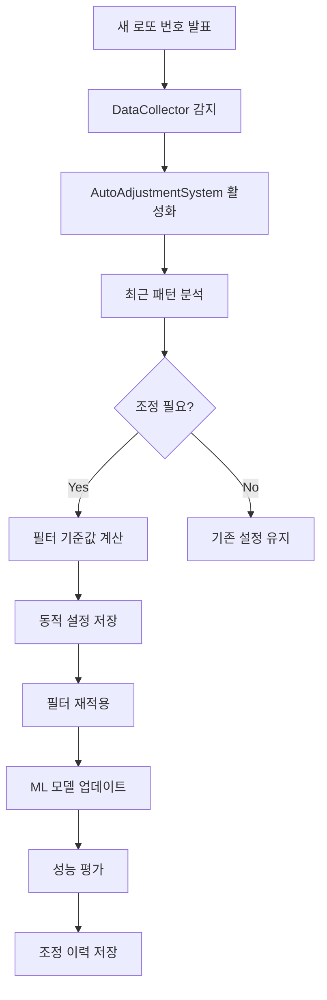

# 자동 조정 시스템 통합 가이드

## 📋 목차
1. [시스템 아키텍처](#시스템-아키텍처)
2. [통합 포인트](#통합-포인트)
3. [자동 조정 플로우](#자동-조정-플로우)
4. [구현 세부사항](#구현-세부사항)
5. [사용 방법](#사용-방법)
6. [모니터링 및 관리](#모니터링-및-관리)

## 🏗️ 시스템 아키텍처

### 기존 시스템 구조
```
┌─────────────────┐     ┌──────────────┐     ┌─────────────┐
│ DataCollector   │────▶│ FilterManager │────▶│ ML Models   │
└─────────────────┘     └──────────────┘     └─────────────┘
        │                       │                     │
        ▼                       ▼                     ▼
   [웹 크롤링]           [고정 필터 적용]      [예측 생성]
```

### 자동 조정 통합 후
```
┌─────────────────────────────────────────────────────┐
│             AutoAdjustmentSystem                    │
│  ┌─────────────┐  ┌──────────────┐  ┌───────────┐ │
│  │ 데이터 감지 │──│ 패턴 분석   │──│ 자동 조정 │ │
│  └─────────────┘  └──────────────┘  └───────────┘ │
└────────────┬──────────────┬──────────────┬─────────┘
             │              │              │
    ┌────────▼───────┐ ┌───▼──────┐ ┌────▼──────┐
    │ DataCollector  │ │ Dynamic   │ │ Realtime  │
    │                │ │ Filters   │ │ Learning  │
    └────────────────┘ └───────────┘ └───────────┘
```

## 🔌 통합 포인트

### 1. **데이터 수집 후 트리거**
```python
# src/data_collector.py 수정 제안
class DataCollector:
    def fetch_lotto_data(self, max_retries=3):
        # 기존 코드...
        
        # 새 데이터 수집 완료 후 이벤트 발생
        if new_data_collected:
            self._trigger_auto_adjustment(new_rounds)
    
    def _trigger_auto_adjustment(self, new_rounds):
        """자동 조정 시스템에 알림"""
        from src.core.auto_adjustment_system import AutoAdjustmentSystem
        auto_system = AutoAdjustmentSystem(self.db_manager)
        auto_system.on_new_data(new_rounds)
```

### 2. **필터 매니저 동적 설정 로드**
```python
# src/core/filter_manager.py 수정
class FilterManager:
    def __init__(self, db_manager):
        # 기존 코드...
        
        # 동적 설정 우선 로드
        self.config = self._load_dynamic_config()
    
    def _load_dynamic_config(self):
        """동적 설정 로드 (있으면 사용, 없으면 기본 설정)"""
        dynamic_path = 'configs/config_dynamic.yaml'
        default_path = 'config.yaml'
        
        if os.path.exists(dynamic_path):
            with open(dynamic_path, 'r', encoding='utf-8') as f:
                return yaml.safe_load(f)
        else:
            with open(default_path, 'r', encoding='utf-8') as f:
                return yaml.safe_load(f)
```

### 3. **ML 모델 통합**
```python
# main.py에서 자동 조정 시스템과 ML 모델 연결
self.auto_adjustment.ml_models = self.ml_models
```

## 🔄 자동 조정 플로우

### 전체 프로세스


### 핵심 메서드 호출 순서
1. `check_and_adjust()` - 메인 조정 프로세스
2. `_check_for_new_data()` - 새 데이터 확인
3. `_analyze_recent_patterns()` - 패턴 분석
4. `_should_adjust_filters()` - 조정 필요성 판단
5. `_adjust_filter_criteria()` - 새 기준값 계산
6. `_apply_adjusted_filters()` - 조정 적용
7. `_evaluate_adjustment_performance()` - 성능 평가

## 🛠️ 구현 세부사항

### 1. **패턴 분석 항목**
- **핫/콜드 넘버**: 출현 빈도 기반
- **합계 범위**: 10-90 백분위수 사용
- **연속번호**: 평균 출현율 + 1
- **홀짝 비율**: 가장 흔한 3개 패턴
- **구간 분포**: 각 10단위 구간별 최소 개수
- **AC값**: 20-80 백분위수 범위
- **최대 간격**: 90 백분위수

### 2. **조정 트리거 조건**
```python
# 다음 중 하나라도 만족하면 조정 실행
- N회차마다 정기 조정 (기본: 10회차)
- 패턴 변화율 > 10%
- 핫넘버 변화 > 10%
- 첫 실행 시
```

### 3. **동적 필터 예시**
```yaml
# configs/config_dynamic.yaml
filters:
  sum_range:
    min_sum: 100  # 동적 조정됨
    max_sum: 170  # 동적 조정됨
  
  consecutive:
    max_consecutive: 2  # 최근 패턴에 따라 조정
  
  hot_cold:  # 새로 추가된 동적 필터
    hot_numbers: [3, 7, 15, 23, 31, 39]
    cold_numbers: [2, 11, 18, 26, 34, 41]
    min_hot_numbers: 2
    max_cold_numbers: 3
```

## 📘 사용 방법

### 1. **일회성 실행**
```bash
# 기본 실행 (자동 조정 포함)
python main_with_auto_adjustment.py

# 기존 방식 (자동 조정 없음)
python main.py
```

### 2. **지속 모니터링 모드**
```bash
# 백그라운드에서 계속 모니터링
python main_with_auto_adjustment.py --mode monitor
```

### 3. **수동 조정 테스트**
```python
from src.core.auto_adjustment_system import AutoAdjustmentSystem

# 시스템 초기화
auto_system = AutoAdjustmentSystem()

# 즉시 체크 및 조정
results = auto_system.check_and_adjust()

# 결과 확인
print(f"새 데이터: {results['new_data']}")
print(f"필터 조정: {results['filters_adjusted']}")
print(f"조정 내역: {results.get('filter_adjustments', {})}")
```

## 📊 모니터링 및 관리

### 1. **조정 이력 확인**
```python
# results/adjustment_history.json 파일 확인
{
  "timestamp": "2024-01-15T10:30:00",
  "round": 1234,
  "adjustments": {
    "sum_range": {"min_sum": 95, "max_sum": 175},
    "consecutive": {"max_consecutive": 2}
  },
  "performance": {
    "filters_adjusted": true,
    "models_updated": true
  }
}
```

### 2. **로그 파일**
- `logs/lotto_system_auto.log` - 전체 시스템 로그
- `logs/auto_adjustment.log` - 자동 조정 전용 로그

### 3. **성능 모니터링**
```python
# 상태 보고서 확인
report = auto_system.get_status_report()
print(report)

# 출력 예시:
# ========================================
# 🤖 자동 조정 시스템 상태 보고서
# ========================================
# 📊 기본 정보:
#   - 현재 회차: 1234
#   - 체크 주기: 3600초
#   - 분석 윈도우: 최근 100회차
# 
# 🔧 마지막 조정:
#   - 시간: 2024-01-15T10:30:00
#   - 회차: 1234
#   - 조정 항목: 7개
```

### 4. **설정 백업**
- 자동으로 `configs/config_backup_YYYYMMDD_HHMMSS.yaml` 생성
- 문제 발생 시 이전 설정으로 복원 가능

## 🚀 고급 설정

### 1. **조정 민감도 변경**
```python
# src/core/auto_adjustment_system.py
self.config = {
    'adjustment_threshold': 0.05,  # 5%로 더 민감하게
    'filter_update_frequency': 5,  # 5회차마다 업데이트
}
```

### 2. **커스텀 패턴 추가**
```python
def _analyze_custom_pattern(self, recent_numbers):
    """사용자 정의 패턴 분석"""
    # 예: 날짜 합 패턴
    date_sum_pattern = self._analyze_date_sum(recent_numbers)
    return date_sum_pattern
```

### 3. **알림 시스템 연동**
```python
def _notify_adjustment(self, results):
    """조정 발생 시 알림"""
    if results['filters_adjusted']:
        # 이메일, 슬랙 등으로 알림
        self.alert_system.send_notification(
            f"필터 자동 조정 완료: {len(results['filter_adjustments'])}개"
        )
```

## 📝 주의사항

1. **성능 고려사항**
   - 패턴 분석은 최근 100회차로 제한
   - 조정은 최소 10회차 간격으로 실행
   - 백업 파일은 주기적으로 정리 필요

2. **데이터 일관성**
   - 조정 중 시스템 중단 시 백업에서 복원
   - 동적 설정과 기본 설정 동기화 확인

3. **테스트 권장사항**
   - 새 조정 로직은 백테스팅으로 검증
   - 조정 전후 성능 비교 모니터링

---

*이 가이드는 지속적으로 업데이트됩니다.*